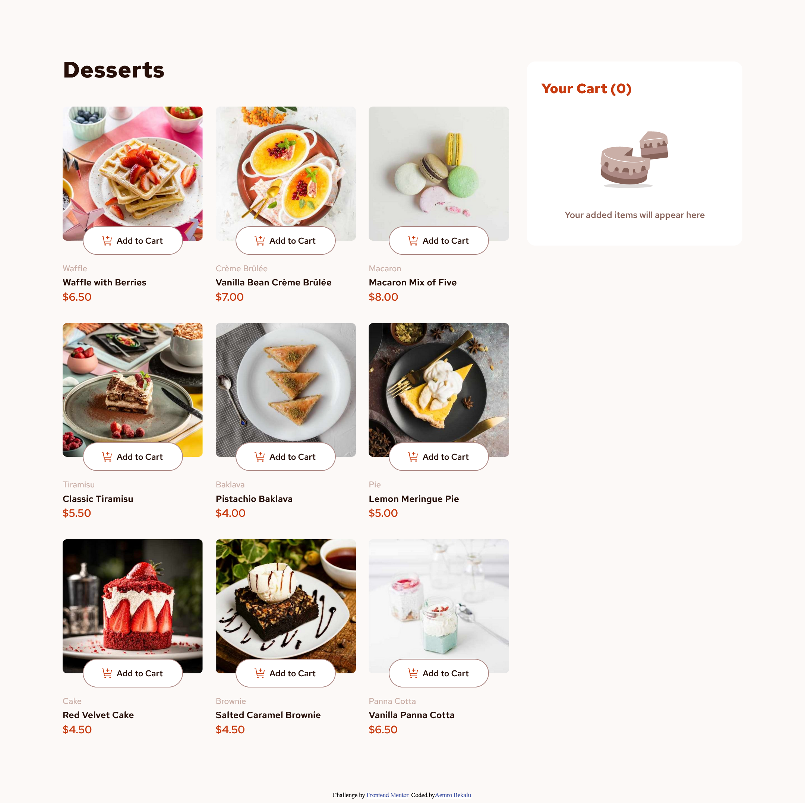
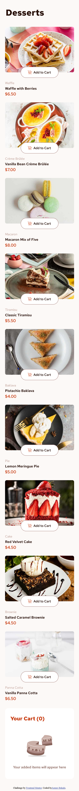

# Frontend Mentor - Product list with cart solution

This is a solution to the [Product list with cart challenge on Frontend Mentor](https://www.frontendmentor.io/challenges/product-list-with-cart-5MmqLVAp_d). Frontend Mentor challenges help you improve your coding skills by building realistic projects.

## Table of contents

- [Overview](#overview)
  - [The challenge](#the-challenge)
  - [Screenshot](#screenshot)
  - [Links](#links)
- [My process](#my-process)
  - [Built with](#built-with)
  - [What I learned](#what-i-learned)
  - [Continued development](#continued-development)
  - [Useful resources](#useful-resources)
- [Author](#author)

## Overview

### The challenge

Users should be able to:

- Add items to the cart and remove them
- Increase/decrease the number of items in the cart
- See an order confirmation modal when they click "Confirm Order"
- Reset their selections when they click "Start New Order"
- View the optimal layout for the interface depending on their device's screen size
- See hover and focus states for all interactive elements on the page

### Screenshot





### Links

- Solution URL: [Add solution URL here](https://your-solution-url.com)
- Live Site URL: [live site URL](https://aemrobe.github.io/produc-list-with-cart/)

## My process

### Built with

- Semantic HTML5 markup
- CSS custom properties
- Flexbox
- CSS Grid
- Mobile-first workflow
- [React](https://reactjs.org/) - JS library

### What I learned

This is my first time when I do a challenge which involve react and I have gained a knowledge of how can you can add items to the cart in react. the new thing which I learn here is how you can manage the same products when you add items to the cart it means for example when you increase the quantity of the product which you added in the cart you shouldn't add the same product information again. you will check if that product already exsists in your cart then if there isn't you will add as a new product but if it is already exsists in a cart you only updates it's information related to quantity property.

here is the code which do that
=> first it will check the new product whose information gonna be added into cart already exsists in the cart using a findIndex method then if the value which we get after using findIndex method is different from -1, it means the product is already in a cart then what will do is using that productIndex we update the totalPrice and quantity information of the product only but if it's value is -1, it means there isn't a product in a cart so we return an array which contains an information of the previous cart and the newproduct information.

```js
const handleAddedToCartList = function (newProduct) {
  setAddToTheCartList((prevCart) => {
    const productIndex = prevCart.findIndex(
      (product) => product.name === newProduct.name
    );

    if (productIndex !== -1) {
      const updatedCart = [...prevCart];

      updatedCart[productIndex] = {
        ...updatedCart[productIndex],
        quantity: newProduct.quantity,
        totalPrice: newProduct.quantity * newProduct.price,
      };

      return updatedCart;
    } else {
      return [...prevCart, newProduct];
    }
  });
};
```

### Continued development

This is my first react project which I have done after I learn the react fundametals from the course which I was following so I will continue to do a projects which involve react to reinforce my knowledge of react.

### Useful resources

- [A complete react course by jonas](https://www.udemy.com/course/the-ultimate-react-course/) - this course helped me to learn and understand the React fundamental and also jonas is a great teacher so I recommend this course for you to learn react.

## Author

- Frontend Mentor - [@aemrobe](https://www.frontendmentor.io/profile/aemrobe)
- Twitter - [@Aemro112](https://www.twitter.com/Aemro112)
